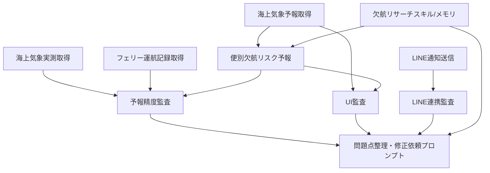

# 自動化ブループリント

## 目的

AI社員をRailway CronまたはCodex Automationへ段階的に移すための実行順序と依存関係を定義する。

## 推奨実行順序

| JST | AI社員 | 処理 | 理由 |
|---|---|---|---|
| 05:00 | 海上気象予報取得 | 7日予報更新 | 朝の仕入れ判断に使う |
| 06:00 | フェリー運航記録取得 | 当日便の初回状態取得 | 当日欠航を早期取得 |
| 06:30 | LINE通知送信（`notification_service.py`） | HIGH リスクの日のみ全ユーザーへ送信 | 朝の仕入れ判断に間に合わせる |
| 06:30 | 海上気象実測取得 | 前日実測更新 | 監査の入力を揃える |
| 07:00 | 予報精度監査 | 前日分の精度検証 | 予測改善の基礎データ |
| 07:10 | UI監査 | API応答・鮮度・航路カバレッジ確認 | データ欠損をユーザー到達前に検出 |
| 07:25 | LINE連携監査 | SDK・ユーザー登録・通知送信実績確認 | 通知失敗の早期発見 |
| 07:30 | 問題点整理 | 異常時のみ修正依頼生成 | 開発タスク化 |
| 11:00 | 海上気象予報取得 | 昼更新 | 予報変化を反映 |
| 17:00 | 海上気象予報取得 | 夕更新 | 翌朝判断に使う |
| 23:00 | 海上気象予報取得 | 夜更新 | 夜間の予報更新反映 |

## 依存関係

## 自動化前に必要な整備

- `actual_weather_collector.py` と `improved_ferry_collector.py` のJST処理を統一する。
- 便別の予報気象を保存する中間テーブルを追加する。
- 運航実績に「気象欠航」「季節運休」「ドック運休」「不明」を分ける評価列を追加する。
- 監査結果を機械可読JSONとして保存する。
- 問題点整理AI社員が読む最新監査サマリを固定パスへ出力する。

## 将来のCodex Automation候補

- 毎朝、前日監査サマリを作り、False Negativeがあれば修正依頼プロンプトを生成する。
- 週1回、航路別・季節別の精度傾向をまとめ、閾値変更案を提示する。
- 月1回、海上気象リサーチメモリを更新し、未確認情報と公式確認済み情報を分離する。

